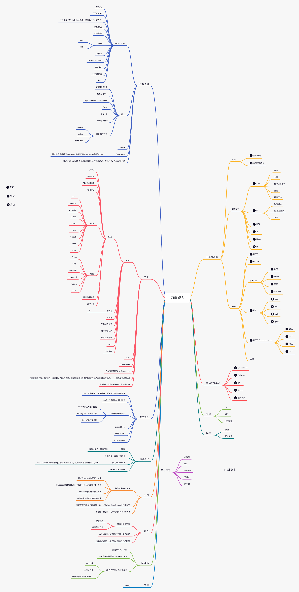

# 前端学习路线

## 一、路线区分

### 一）、WEB基础

#### （一）、HTML/CSS相关

#### （二）、JavaScript相关

#### （三）、Canvas

#### （四）、TypeScript

#### （五）、Http等

### 二）、Vue

#### （一）、Vue

#### （二）、Vuex

#### （三）、Vue-Router

#### （四）、Webpack

#### （五）、Vite

### 三）、React

### 四）、安全

#### （一）、xss

#### （二）、csrf

#### （三）、前端存储的安全性

##### 1）、cookie

##### 2）、storage

##### 3）、indexDB

#### （四）、token的存储

#### （五）、理解OAuth

#### （六）、single sign on

### 五）、性能优化

#### （一）、缓存

#### （二）、打包优化

#### （三）、图片类型的选用

#### （四）、Server Side Render（SSR）

### 六）、打包

#### （一）、熟练使用webpack

#### （二）、vite

#### （三）、dockerfile

### 七）、部署

#### （一）、前端的部署方式

#### （二）、Nginx配置

#### （三）、云服务

### 八）、Nodejs

#### （一）、基础入门

#### （二）、事件循环机制

#### （三）、服务端框架

##### 1）、Express

##### 2）、koa

##### 3）、egg

##### 4）、nestjs

#### （四）、Backend For Frontend（BFF）

### 九）、监控

（一）、Sentry

### 十）、计算机基础

#### （一）、算法

##### 1）、排序算法

##### 2）、深度优先遍历

#### （二）、数据结构

##### 1）、链表

##### 2）、树

##### 3）、队列

##### 4）、栈

##### 5）、HASH

##### 6）、图

#### （三）、网络

##### 1）、HTTP

##### 2）、HTTPS

##### 3）、请求类型

##### 4）、URL

##### 5）、HTTP Response Code 

##### 6）、CDN

### 十一）、代码相关基础

#### （一）、Clean Code

#### （二）、Refactor

#### （三）、Git

#### （四）、Debug

#### （五）、设计模式

### 十二）、自动化构建

#### （一）、CI

#### （二）、CD

#### （三）、如何差错

### 十三）、流程

#### （一）、敏捷

#### （二）、开发流程

### 十四）、其他方向

#### （一）、小程序

#### （二）、H5

#### （三）、混合开发/App

#### （四）、性能优化

#### （五）、可视化

#### （六）、跨平台

### 十五）、前端新技术

（一）、HarmonyOS